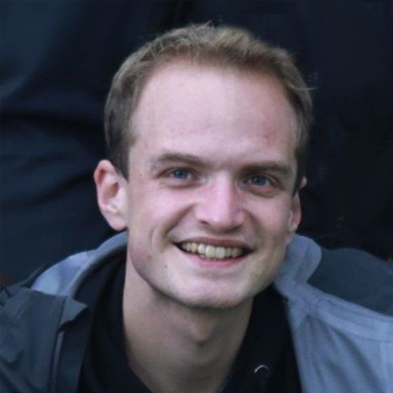
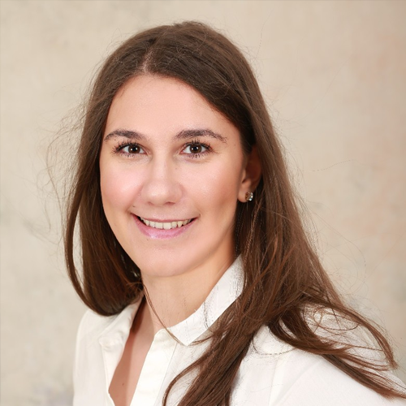
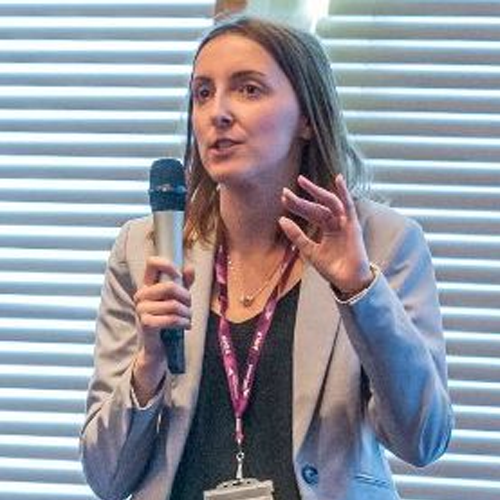

# Contacts
For any private query, email us [d2t2024@googlegroups.com](mailto:practicald2t@googlegroups.com). 
If you have any problem with the above mail group, contact [balloccu@ufal.mff.cuni.cz](balloccu@ufal.mff.cuni.cz)

For **public queries**, following the news, and discussing related topics, please use the [https://groups.google.com/g/public-d2t2024/](https://groups.google.com/g/public-d2t2024/) Google Group.

## Organizers

  

      
      <a href="https://uccollab.github.io/">
          
Simone Balloccu

      </a>
      Charles University
  

  

      
      <a href="https://kasnerz.github.io">
          
Zdeněk Kasner

      </a>
      Charles University
  

  

      
      <a href="http://opla.cz">
          
Ondřej Plátek

      </a>
      Charles University
  

  

      
      <a href="https://patuchen.github.io/">
          
Patrícia Schmidtová

      </a>
      Charles University
  

  

      
      
Kristýna Onderková

      Charles University
  

  

      
      <a href="https://ufal.mff.cuni.cz/mateusz-lango">
          
Mateusz Lango

      </a>
      Charles University
  

  

      
      <a href="https://tuetschek.github.io/">
          
Ondřej Dušek

      </a>
      Charles University
  

  

      
      <a href="https://caisa-lab.github.io/members/lucie-flek.html">
          
Lucie Flek

      </a>
      University of Bonn
  

  

      
      <a href="https://ehudreiter.com/">
          
Ehud Reiter

      </a>
      University of Aberdeen
  

  

      
      <a href="https://dimitragkatzia.wordpress.com">
          
Dimitra Gkatzia

      </a>
      Edinburgh Napier University
  

  

      
      <a href="https://www.adaptcentre.ie/experts/simon-mille/">
          
Simon Mille

      </a>
      ADAPT Centre
  

 <!--organizer-container!-->

## Acknowledgments

Funded by the European Union (ERC, NG-NLG, 101039303)

