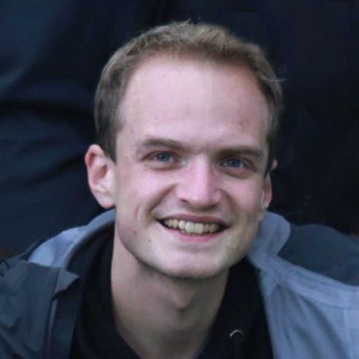
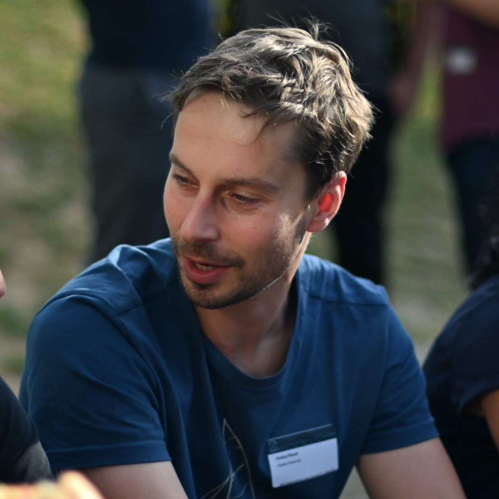
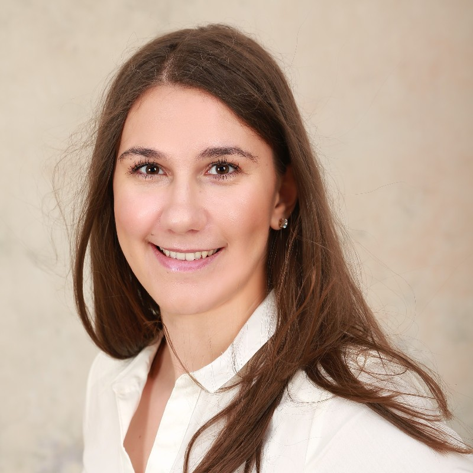
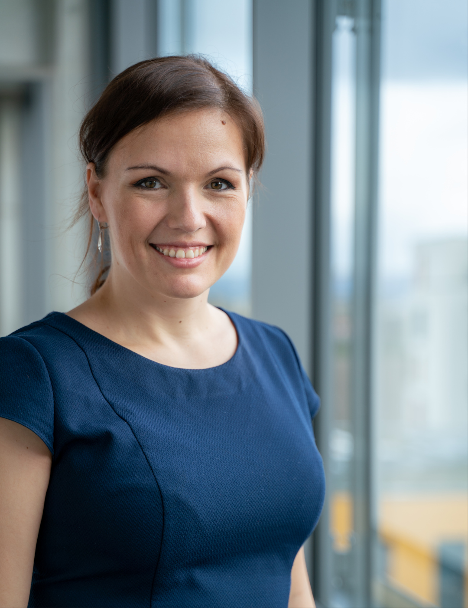
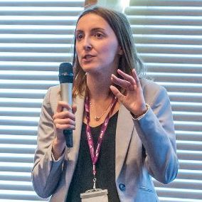
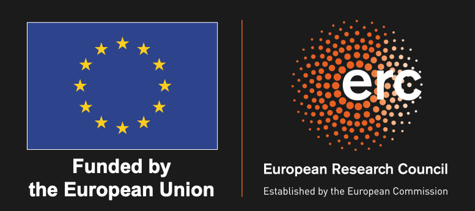

 

 <!-- 

    
    <a href="https://github.com/practicald2t/hackathon/">
    
Hackathon – Github

    </a>

 -->

*Shared Task: Improving Semantic Accuracy D2T (with LLM)*

*Special Track: Neuro-Symbolic D2T*

### Topic

TBD

## Invited Talk

TBD

## Important Dates
TBD

## Submissions
TBD

Please, send your submissions to [practicald2t@googlegroups.com](mailto:practicald2t@googlegroups.com) with the subject "[Submission] {title of your work}" before the submission deadline (see below).

## For participants
TBD

## Schedule 
TBD

## Organizers

    
    <a href="https://uccollab.github.io/">
        
Simone Ballocu

    </a>
    Charles University

        
        <a href="https://kasnerz.github.io">
            
Zdeněk Kasner

        </a>
        Charles University
    

    

    
    <a href="http://opla.cz">
    
Ondřej Plátek

     </a>
    Charles University

    
    <a href="https://patuchen.github.io/">
        
Patrícia Schmidtová

    </a>
    Charles University

    <!--  -->
    <a href="TBD">
        
Kristýna Onderková

    </a>
    Charles University

    
    <a href="https://ufal.mff.cuni.cz/mateusz-lango">
        
Mateusz Lango

    </a>
    Charles University

    
    <a href="https://tuetschek.github.io/">
        
Ondřej Dušek

    </a>
    Charles University

    
    <!-- <a href="https://lucieflek.github.io"> -->
    <a href="https://caisa-lab.github.io/members/lucie-flek.html">
        
Lucie Flek

    </a>
    University of Bonn

    
    <a href="https://ehudreiter.com/">
        
Ehud Reiter

    </a>
    University of Aberdeen

    
    <a href="https://dimitragkatzia.wordpress.com">
        
Dimitra Gkatzia

    </a>
    Edinburgh Napier University

    
    <a href="https://www.adaptcentre.ie/experts/simon-mille/">
        
Simon Mille

    </a>
    ADAPT Centre

 <!--organizer-container!-->

## Acknowledgments

Funded by the European Union (ERC, NG-NLG, 101039303)

## Previous Years
<a href="/2023/"> 2023: 1st Workshop on Practical LLM-assisted Data-to-Text Generation</a>

    © 2023. Built using Jekyll <a href="https://github.com/pages-themes/hacker">Hacker theme</a> and icons from <a
      href="https://flaticon.com">flaticon.com</a>.
  

