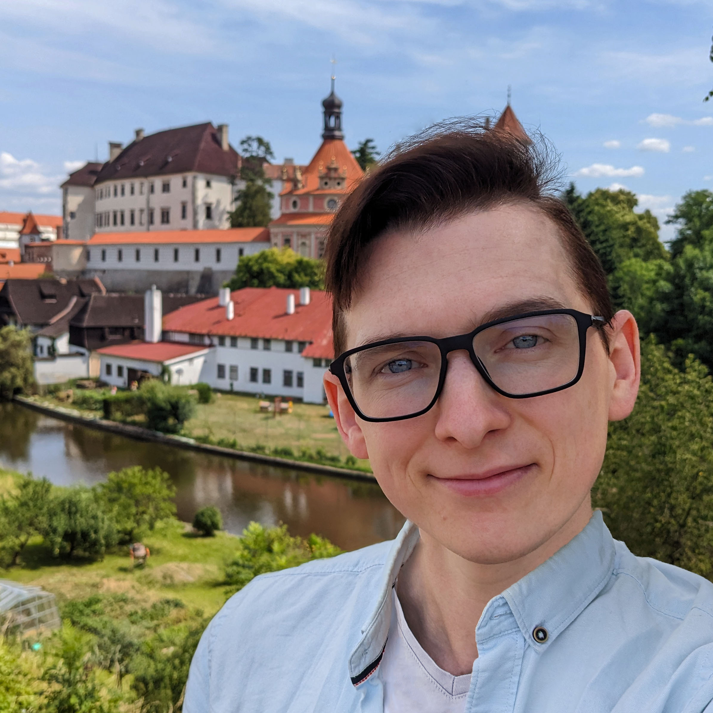
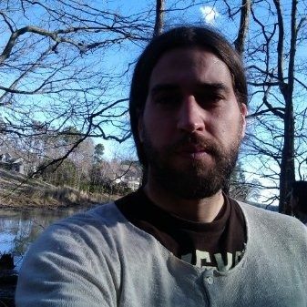

 

    
    <a href="https://forms.gle/Ze15Fbd2kG6RQV8D9">
    
Pre-register

    </a>

    
    <a href="https://forms.gle/ZCjZPtkxBgfwKDYd8">
    
Suggest a topic

    </a>

    
    <a href="mailto:practicald2t@googlegroups.com">
    
Submit your work

    </a>

*Playing with large language models can be fun. But what if you really need them?*

## Hackathon
Bring your own laptop, programming skills, and open mind. In a team of 3-5 people, you will have 6 hours to build a system for **data-to-text generation**. 

Such a system often takes years to build. But you will be allowed to use the newest nightmare of high-school teachers: **large language models**™ 🦜. Will your system output **fluent and accurate texts**?

The hackathon is an official workshop for the joint <a href="https://2023.sigdial.org">SIGDIAL</a> / <a href="https://inlg2023.github.io">INLG</a> 2023 conference and will take place at the same venue.

### Topic
The topic will revolve around generating text based on structured data – e.g., automatically generating weather forecasts, news articles, or sports reports. The specific assignment will announced to the participants at the beginning of the hackathon. 

Do you have a specific topic suggestion in mind? Let us know through the following 👉️ **[form](https://forms.gle/ZCjZPtkxBgfwKDYd8)**!

## Invited Talk

### Tom Kocmi

**The Evolution of Automatic Metrics and Open Challenges in LLM era**

For years, the progress in modeling has outpaced the evaluation in NLP, where we relied predominantly on string-based matching metrics. In this talk, we will outline the differences and benefits between the three classes of metrics: n-gram matching (such as ChrF or BLEU), pretrained models (COMET, BLEURT), and the emerging group of black-box LLMs (GEMBA). We will primarily focus on the last group and how it may shift approach to the automatic evaluation, highlighting open questions and challenges anticipated in the new LLM era.

        
        <a href="http://kocmi.tk">
            
Tom Kocmi

        </a>
        Microsoft

       Tom Kocmi is Senior Researcher at Microsoft, focusing on evaluation of machine translation (MT). His recent work includes an extensive evaluation of automatic MT metrics and using LLMs as the state-of-the-art evaluator of generated MT text.

*Note: The original talk of Craig Thomson has been cancelled since Craig could not participate in the conference.*

## Submissions
We invite participants to submit their work which will be presented as a poster during the hackathon. Our workshop is **non-archival**, meaning that the paper **will not** appear in the conference proceedings.

The submission should include a poster + paper abstract. We welcome work in progress & work published at other venues.

The topics we are interested in include:
- innovative datasets and benchmarks for data-to-text generation,
- integrating language models in data-to-text generation systems,
- comparing and evaluating neural-based and rule-based data-to-text generation.

Please, send your submissions to [practicald2t@googlegroups.com](mailto:practicald2t@googlegroups.com) with the subject "[Submission] {title of your work}" before the submission deadline (see below).

## For participants

### Hackathon
On-site attendance is necessary for participating in the hackathon.

Please, indicate your interest in the hackathon by filling the following 👉️ **[Google Form](https://forms.gle/Ze15Fbd2kG6RQV8D9)** until 10 September 2023.

Each team will present their outcomes at the end of the hackathon. Based on the results, we will decide on a suitable form of disseminating the workshop findings.

Note that the goal of the hackathon not to win (or even build a well-functioning system), but to get acquainted with large language models, and bootstrap future research projects & collaborations. Feel free to apply regardless of your skills or competitive abilities!

### Submissions
- **Submission deadline**: 15 August 2023
- **Acceptance notification**: 22 August 2023

Note that submitting your work is optional, i.e. even without an accepted paper you can still participate in the hackathon.

## Schedule
The hackathon will take place on **11th September 2023**.

Preliminary schedule:

| Time (CEST)   | Event               |
| ------------- | ------------------- |
| 9:00 - 10:00  | Invited talk        |
| 10:00 - 12:30 | Hackathon           |
| 12:30 - 13:30 | Lunch break         |
| 13:30 - 14:00 | Poster session      |
| 14:00 - 17:30 | Hackathon           |
| 17:30 - 17:55 | Results, discussion |
| 17:55 - 18:00 | Closing remarks     |

## Organizers

        
        <a href="https://kasnerz.github.io">
            
Zdeněk Kasner

        </a>
        Charles University
    

    

    
    <a href="http://opla.cz">
    
Ondřej Plátek

     </a>
    Charles University

    
    <a href="https://tuetschek.github.io/">
        
Ondřej Dušek

    </a>
    Charles University

    
    <a href="https://dimitragkatzia.wordpress.com">
        
Dimitra Gkatzia

    </a>
    Edinburgh Napier University

    
    <a href="https://www.adaptcentre.ie/experts/simon-mille/">
        
Simon Mille

    </a>
    ADAPT Centre

    © 2023. Built using Jekyll <a href="https://github.com/pages-themes/hacker">Hacker theme</a> and icons from <a
      href="https://flaticon.com">flaticon.com</a>.
  
