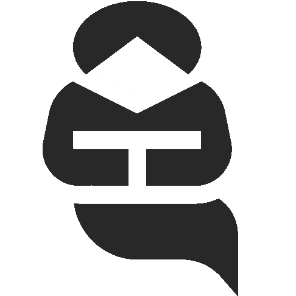

 

 

    
    <a href="https://github.com/kasnerz/factgenie/">
    
See <i>factgenie</i> on GitHub

    </a>

 

    
    <a href="https://quest.ms.mff.cuni.cz/namuddis/factgenie/browse?dataset=st24-openweather&split=dev&example_idx=0">
    
Browse some examples of datasets in the deployed <i>factgenie</i> instance

    </a>

# Hackathon
Practical D2T 2024 features a hackathon focused on improving the semantic accuracy of D2T systems. Join us and get hands-on experience with easy and quick LLM as judge and comparable human annations! Let's explore the NLG outputs together at the hackathon on Monday 💪
Join us on September 23rd, and explore LLMs for:

1. Generating textual summaries from structured data as input
2. Detecting different categories of errors in the obtained summaries 
3. Comparing error detection capabilities with those of human annotators.

For all of the above tasks, we will use <a href="https://github.com/kasnerz/factgenie/"><i>factgenie</i></a>, our web framework for annotating and visualizing word spans in textual model outputs. With <a href="https://github.com/kasnerz/factgenie/"><i>factgenie</i></a>, both humans and LLMs can be used to annotate various span-based errors including semantic inaccuracies or irrelevant text.

For this hackathon, we will work on various domains using recent structured data in the form of JSONs and CSVs. You can take a first look at the data in the online [factgenie-demo](https://quest.ms.mff.cuni.cz/namuddis/factgenie/browse?dataset=st24-openweather&split=dev&example_idx=0) we prepared. You can also see some examples of LLM-driven D2T and error annotation: try selecting the dataset (top left) _st24-openweather_, and the annotations (top right) _st24-demo-openweather-dev-llama3_. You will see what kind of weather summaries _Mistral_ produces, and how _LLama 3_ tries to spot eventual errors.

## Expression of interest in participating
If you wish to take part in the hackathon, please consider sending an email to [d2t2024@googlegroups.com](mailto:d2t2024@googlegroups.com), with object "Hackathon Participation", and let us know if you will take part individually or as a group (in this case, let us know how many people are expected to take part).

## Phase 1: Intro + generation (50 min)

During the first part of the hackathon, we will give you a quick tour of <a href="https://github.com/kasnerz/factgenie/"><i>factgenie</i></a> and its features. This phase will be focused on generation, so we will work together on prompting open LLMs to produce summaries from structured data. Feel free to variate your prompts, parameters and play with different datasets to get the best output!

## Phase 2: Annotation and results (80 minutes)

Next, it's time to see how good the obtained summaries are! We will explore the second feature of <a href="https://github.com/kasnerz/factgenie/"><i>factgenie</i></a>, that is error annotation. During this phase, you can play with different LLMs as error annotators. JUst like before, you can variate the model, prompts and parameters, but also, introduce new error categories besides those we will provide.

At the same time, we will gather some human error annotation, to compare them with the LLMs' ones. It is up to you to decide if you want to help us by quickly annotating a couple of summaries, focus on annotation through LLMs, or both!

Finally, we will correlate human annotation against LLMs ones, and discuss the results.

# FAQs

**Q:** Where does the datasets come from?  
**A:** Our datasets are sourced by querying existing open APIs to retrieve tabular data across various domains. We adopt this approach as LLMs potentially met this kind of data during pre-training/RL. We query very recent data tables to minimise the risk of data contamination.

**Q:** Can I use my custom model (e.g. fine-tuned, architectural changes etc) during the hackathon?  
**A:** You can integrate your model in factgenie if you wish to, but this will not be the main focus of the hackathon. Also, make sure that your model can run on an NVidia A100 or A40 (48GB VRAM).

Should you have any other questions, feel free to contact the organisers.

## Acknowledgments

Funded by the European Union (ERC, NG-NLG, 101039303)

    © 2023. Built using Jekyll <a href="https://github.com/pages-themes/hacker">Hacker theme</a> and icons from flaticon.com.
  

