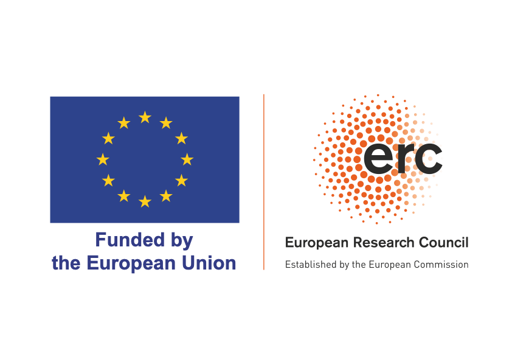

 

 <!-- 

    
    <a href="https://github.com/practicald2t/hackathon/">
    
Hackathon – Github

    </a>

 -->

# Shared task 
Practical D2T 2024 features a shared task on improving semantic accuracy of D2T systems. Participants will build an LLM-assisted D2T system to generate textual reports from various domains. We provide a new dataset with recent data (in the form of JSONs and CSVs) from four domains:

- openweather: weather data 
- gsmarena: product descriptions (specifically smartphone specs) -
- ice_hockey: sport results (specifically hockey) - 
- owid: time-series covering data from misc. origins - 

This data (from now on referred to as "known domain data") can be downloaded from [here]([https://practicald2t.github.io/assets/shared_task_data.zip](https://practicald2t.github.io/assets/shared_task_data/known_domains.zip)). The dataset is sourced from public APIs, to limit potential previous exposure to the used LLMs. Each domain contains a dev and a test set.

## Phase 1: System development
**Deadline: ** 29 July AoE
During this phase, use the known domain data to develop and evaluate your LLM-assisted D2T system. 
For evaluation, we will provide an initial scripts that prompts LLM to evaluate a series of measures, including fluency and semantic accuracy.
**The evaluation script will be provided soon. Meanwhile, you can start working on your system by using the provided dataset.** 

### Variation of the evaluation script 
Our script can be customised with different LLMs and prompts. You are encouraged to modify/improve the script to explore different evaluation methodologies.
Suggested LLMs are:
- Llama3
- Phi3
- Qwen2
- Mistral
You can provide your own custom model checkpoints (along with details on the model characteristics), as long as the format is compatible with the aforementioned ones. Find more info about this in [FAQs](#faq).

Once you have finalized your system, submit your best output, evaluation results and eventual modified evaluation script. 

## Phase 2: Output submission and surprise domain evaluation
**Deadline: ** 5 Aug AoE
Upon submission, you will receive an additional test-set covering a surprise domain, to test the robustness of your system/evaluation. You will have one week to send back you system's outputs on the new test-set. If you developed a custom evaluation (i.e. modifying the script), you must provide results for both the initial and modified scripts.

## Phase 3: Final automatic and human evaluation
Once we receive all submissions, we will evaluate every received output against every received evaluation script. Finally, we will run a human evaluation on all the received outputs, and correlate human judgements against the automatic evaluations. At the workshop, we will present results and insights of our evaluation: how every script works on different system outputs, and how they correlate with human annotators. The system reaching the highest correlation with humans will be declared winner of the competition. Results and participants’ system descriptions will be featured in the workshop proceedings. 

# Submission
For your participation to be valid, you will need to submit your
  1. Best output (textual summaries produced by their system)
  2. Results of our evaluation script
  3. Eventual custom evaluation results, along with the modified script and every element (i.e. model checkpoint) necessary to run it
  4. System description (1+ page)

Your system description must follow the submission template and guidelines issued by INLG 2024.

# FAQ for the shared task

**Q:** Where does the shared task dataset come from?  
**A:** Our dataset is sourced by querying existing open APIs to retrieve tabular data across various domains (like weather, sports results etc). We adopt this approach as LLMs potentially met this kind of data during pre-training/RL. We query very recent data tables to minimise the risk of data contamination.

**Q:** Can I use my custom model (e.g. fine-tuned, architectural changes etc) if it is not among the suggested ones?  
**A:** As we will have to re-run every custom evaluation against all participants' submitted outputs, we aim to do it in the most painless way possible. If you plan to submit an evaluation script using a custom model, please send us model checkpoints (HuggingFace format) and make your script compatible with Pytorch and Ollama (versions to be announced). Generally, we should be able just to run your evaluation script and get the results. 

**Q:** How big can the model I will use for custom evaluation be?  
**A:** Your model should be able to run on an NVidia A100 or A40 (48GB VRAM). The use of quantisation is allowed, but this should, again, be set up by you in the script you will submit.

**Q:** I want to develop a neurosymbolic D2T system/evaluation script for the shared task. Can I?  
**A:** Yes! In light of our workshop's interest in neuro-symbolic D2T, participants of the shared task are welcome to include symbolic knowledge, intermediate representations etc. Please remember that you still need to adhere to the above points.

Should you have any other question, feel free to contact the organisers.

## Acknowledgments

Funded by the European Union (ERC, NG-NLG, 101039303)

    © 2023. Built using Jekyll <a href="https://github.com/pages-themes/hacker">Hacker theme</a> and icons from flaticon.com.
  

