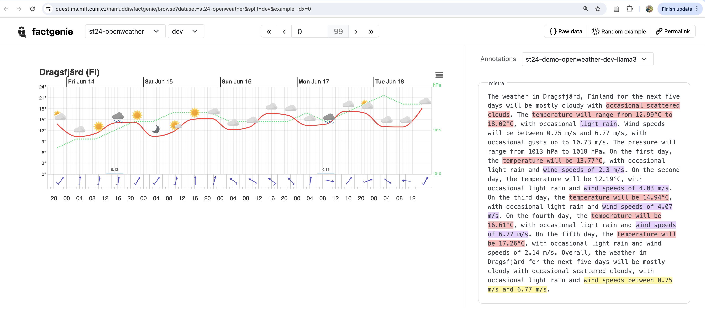

 <div class="forms-container">

 <div class="forms">
    <a href="https://github.com/kasnerz/factgenie/">
    <p style="font-size: large"><i>Factgenie</i> Toolking for Annotating and Visualizing LLM Hallucinations</p>
    
    </a>
</div>

</div>

# Running an Evaluation Script for the Shared Task Datasets

- We use the https://github.com/kasnerz/factgenie/ framework in the shared task for running the LLM evaluation (annotation of the data-to-text system outputs using LLMs).
    - **We strongly encourage to run it locally and visualize and evaluate your outputs in factgenie**
    - _factgenie_ has cli `factgenie run-llm-eval` for running the evaluation from CLI. 
    - _factgenie_ can run the same evaluation interactively in a browser at _http://127.0.0.1:5000/llm-eval_. It is great for debugging the prompt. 
- We use _factgenie_ webserver also for visualization of the annotation and the datasets themselves.
- Before using any dataset one needs to prepare dataloading of the datasets in _factgenie_. Luckily, we have added the shared tasks _st-*_ datasets to _factgenie_ for you.

## Looking at the result: Shared Task datasets and annotations
Before we start, let's look at running _factgenie_ instance deployed at:

<a href="https://quest.ms.mff.cuni.cz/namuddis/factgenie/browse?dataset=st24-openweather&split=dev&example_idx=0">
    https://quest.ms.mff.cuni.cz/namuddis/factgenie/browse?dataset=st24-openweather&split=dev&example_idx=0
    <br/>
    <br/>
    
</a>

- There are an _Openweather_ domain input data examples released as _st24-openweather_ dataset.
- The output from a _mistral_ model was generated using https://github.com/kasnerz/quintd/ (in particular this [version](https://github.com/kasnerz/quintd/pull/4))
- The annotations with id _st24-demo-openweather-dev-llama3_ were generated using the following command

```
factgenie run-llm-eval \
  --campaign_name st24-demo-openweather-dev-llama3 \
  --dataset_name st24-openweather \
  --split dev \
  --llm_output_name mistral \
  --llm_metric_config factgenie/llm-eval/ollama-llama3.yaml
```


## Running the evaluation

1. Go through the [README.md](https://github.com/kasnerz/factgenie/blob/main/README.md) and install dependencies.
2. [(Optionally) Look at how we added the shared [task datasets](https://github.com/kasnerz/factgenie/pull/35#issue-2384606283) in the section _How to evaluate the existing outputs?_
3. At the same [PR](https://github.com/kasnerz/factgenie/pull/35#issue-2384606283) look at the section _How to evaluate the existing outputs?_ and learn how to run the _factgenie run-llm-eval_ command
4. Finally, look at how you can add your model outputs to factgenie to be evaluated.
   Here is [the example](https://github.com/kasnerz/factgenie/pull/35/files#r1665339740) for _mistral_ model.
   Assuming you have outputs from an _awesome_model_ for the input data from the _dev_ split of the _st24-gsmarena_ datasets; then you need to create file  `factgenie/outputs/st24-gsmarena/dev/awesome_model.json` with the [structure described in the example](factgenie/outputs/st24-gsmarena/dev/mistral.json):

    The following structure is required for the LLM output file

    ```
    {
        "setup" {
            "id": "mistral",
            "model": "mistral"
        },
        "generated": [{"out": "first llm output}, {"out": "second llm output"}, ..., {"out": "Last llm output"}]
    }
    ```
    The rest of the fields are ignored by _factgenie_. In this case, the rest of the fields were used by https://github.com/kasnerz/quintd to generate the _mistral.json_ file and to obtain the LLM outputs based on the dataset inputs.